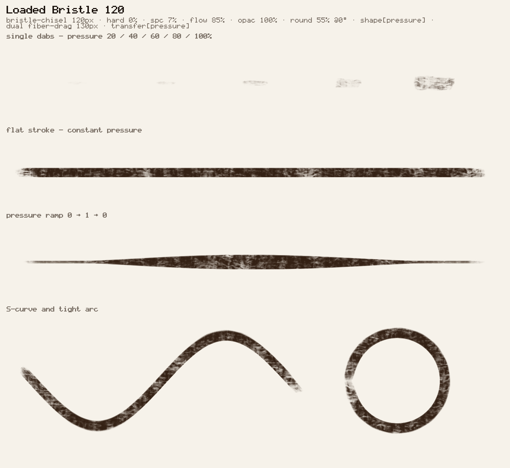

# brushstudio

A harness for designing digital painting brushes for Photoshop — with an
agent doing the iteration and a human deciding whether the mark is any good.

The brush engine is Photoshop's, near enough: dab dynamics, dual-brush
masking, texture, transfer, scattering and colour dynamics, extracted from
[northlight](https://github.com/abarth/northlight) along with its `.abr`
reader and writer. What is new here is the loop around it — brushes as
files, a fixed page of test marks, numbers for the things eyes judge badly,
and a `.abr` at the end that Photoshop actually loads.

```bash
npm install
npm run brush -- render brushes/bristle-oil.json --annotate
```



## Why a harness

Brush design is a slow loop with an expensive step in the middle. Turning
knobs is cheap; deciding whether the result is *right* needs a person who
paints. Most of the iteration, though, is not taste at all — it is checking
whether the tip is visibly stamping, whether the stroke breaks, whether
pressure reaches anything, whether the export survived. A machine can answer
all of those, and should, so that the human's attention goes only where it
is the scarce resource.

So the harness is built to make everything *except* the judgement cheap:

* **A brush is a file.** `brushes/*.json`, a patch over the engine defaults,
  with the design intent in `notes`. Revisions diff as decisions.
* **The same marks every time.** Dabs at five pressures, a flat stroke, a
  pressure taper, an S-curve and a tight arc, crosshatch, wash, tilt sweep,
  and a slow-to-fast run. Two revisions diff as images; a design sits beside
  a reference honestly.
* **Numbers where eyes are unreliable.** Coverage against density,
  a spectral test for stamp repetition, worst gap, pressure response,
  build-up over repeated passes, and how much the mark moves between seeds.
* **A real `.abr` at the end**, verified by reading its own bytes back.
* **A renderer that suits the loop.** Marks are painted in-process by a CPU
  renderer, so a measurement is a second rather than a wait; the WebGPU
  engine the interactive app uses is a flag away, and a parity test keeps
  the two honest. See `docs/backends.md`.

## The loop

```
brief ──▶ study ──▶ draft ──▶ measure ──▶ render ──▶ REVIEW ──▶ revise ──▶ ship
```

`docs/workflow.md` is the long version, including which questions belong to
the harness and which belong to the human. In short: the harness settles
whether a brush *works*; the human settles whether it is *good*.

For the second, there is a try-out app — `npm run dev` — where a reviewer
paints with the brush by hand, moves the sliders, and hits **Copy settings
patch**. Their fiddling comes back as JSON that drops straight into the
brush document, instead of a description that has to be re-guessed. The
panel lists every document in `brushes/`, shows the bitmap sitting in each
tip and texture slot beside the picker that swaps it, and collapses the
sections that are switched off. It reaches every field the engine has — the
Control behind each jitter, both texture blend modes, the two colours Color
Dynamics works between — and `npm test` fails if one of them falls off.

## Commands

| | |
| --- | --- |
| `npm run brush -- list` | built-in tips, patterns, and test strokes |
| `npm run brush -- show    brushes/x.json` | the resolved settings, expanded and checked |
| `npm run brush -- render  brushes/x.json` | the plate of test marks |
| `npm run brush -- measure brushes/x.json` | the numbers |
| `npm run brush -- compare brushes/x.json --ref refs/P.abr#"Name"` | design beside reference |
| `npm run brush -- inspect refs/P.abr --json` | read a Photoshop pack apart |
| `npm run brush -- export  brushes/pack.json -o out/P.abr` | ship it |
| `npm run dev` | paint with it by hand |
| `npm test` | the harness still tells the truth |

Add `--backend gpu` to any command to paint with the WebGPU engine in
headless Chromium instead of the in-process CPU renderer — slower, and the
reference when a mark's correctness is in question.

## Studying other people's brushes

`inspect --json` returns each brush in a pack as the **minimal patch**
against the engine defaults, so the few values that make it distinctive are
not buried in fifty defaults, and `--render` runs its brushes through the
same test marks your own designs get. Put reference packs in `refs/` — it is
gitignored, because most are licensed work.

## Layout

```
brushes/        brush documents and packs — the designs
src/brush/      the brush engine: dynamics, tips, patterns, .abr read/write
src/gpu/        the WebGPU stamp/composite pipeline
src/harness/    documents, test strokes, plates, measurements
tools/          the CLI
web/            the try-out app
docs/           workflow, parameters, brush format, .abr notes, provenance
```

`docs/parameters.md` is worth reading before turning knobs: a handful of
*ratios* — flow over spacing, scatter over spacing — decide most of what a
mark looks like, and almost every "why does this look fake" is one of them
being wrong.

## Licence

Apache-2.0, as is northlight. See `docs/provenance.md` for exactly what was
extracted and how to keep it in sync.
